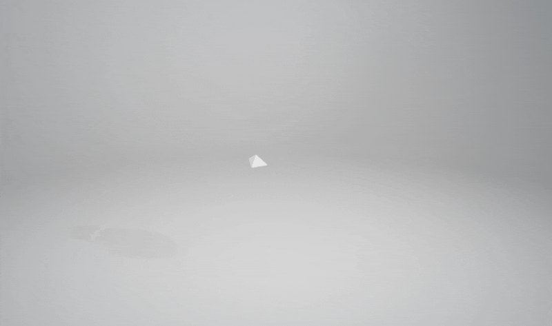

# Volumesh
Utility for creating volumetric mesh container files in glTF format.

[](https://easyguet.ch/ias/volumesh-viewer/?model=hypergrid)

*Hypergrid example ([hypergrid.glb](https://easyguet.ch/ias/volumesh-viewer/hypergrid.glb)) (Source: [Justin Jensen](https://github.com/neverhood311/Stop-motion-OBJ/wiki#gallery))*

## Installation

```
pip install volumesh
```

### Draco Compression
To install the [Google Draco](https://google.github.io/draco/) compression the [DracoPy](https://github.com/seung-lab/DracoPy) library is needed. Because it is still under development, we just include it if the [extra](https://packaging.python.org/en/latest/tutorials/installing-packages/#installing-setuptools-extras) `draco` is specified.

```
pip install "volumesh[draco]"
```

## Usage

To convert a sequence of OBJ files into a volumesh container use the following command:

```bash
volumesh ./data test.glb
```

First specify the folder where the OBJ's are located (`data`) and then the output file (`test.glb`). Use the `--compressed` flag if you have `draco` extras installed and want to compress the container.
The following information will be stored into the mesh if available:

* vertices
* triangle indices
* normals
* vertex-uvs
* textures (png / jpeg)

### Limitations
If draco compression is turned on, only **vertex** and **triangle** information is stored into the mesh. This is due to the fact that [DracoPy](https://github.com/seung-lab/DracoPy) does only support these two primitive values. At the moment we recommend to not use the internal compression, but convert the sequence into a glb file and later convert it using the [gltf-pipeline](https://github.com/CesiumGS/gltf-pipeline). This leads to way better compression and contains still all information parts:

```
gltf-pipeline -i .\sequence.glb -o .\sequence-draco.glb -d
```

### Animation
To use the GLTF animation system to render the meshes in a sequence, it is possible to specify the framerate (default `24`) and set the animation flag. Volumesh will add an animation track which hides and shows the objects after each other using the glTF animation tools.

```
volumesh ./human test.glb --animate --fps 24
```

### Help

```bash
usage: volumesh [-h] [--compressed] [--jpeg-textures]
                [--jpeg-quality JPEG_QUALITY] [--animate] [--fps FPS]
                [-tex TEXTURE_SIZE] [--load-safe]
                input output

A utility to create volumesh files.

positional arguments:
  input                 Path to the mesh (*.obj) files (directory).
  output                GLTF output file (.glb).

options:
  -h, --help            show this help message and exit
  --compressed          Compress the mesh data with Draco compression.
  --jpeg-textures       Use JPEG compression for textures instead of PNG.
  --jpeg-quality JPEG_QUALITY
                        JPEG quality parameter.
  --animate             Animate mesh frames with GLTF animation system.
  --fps FPS             Animation frames per second (fps).
  -tex TEXTURE_SIZE, --texture-size TEXTURE_SIZE
                        Limit texture size to the specified width.
  --load-safe           Load meshes slow but save.
```

## About
Copyright (c) 2024 Zurich University of the Arts ZHdK

